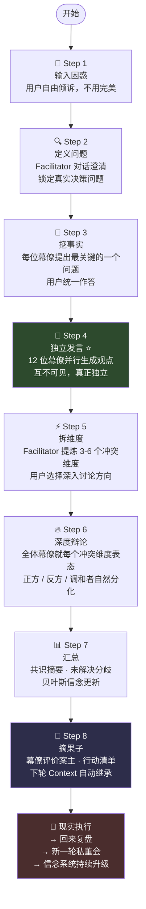
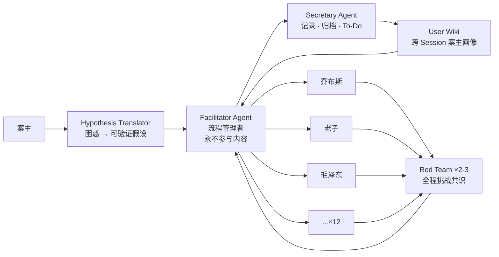
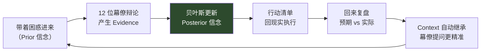

# 参谋 · Counsel AI
### AI 私董会圆桌系统 — 你的 12 位哲学幕僚，随时在场

> "一个人的盲区，参谋来照亮。"

---

## 这是什么？

**参谋**是一套多智能体 AI 决策辅助系统。

它为面对高度不确定性的创业者、领导者和决策者设计——当你需要同时用 12 种不同的哲学框架审视同一个问题时，它让这件事变得可能。

不是角色扮演游戏。不是聊天机器人。  
是一套**认知基础设施**——把人类本来无法持续执行的高水平思维操作，系统化、可重复地保障下线。

---

## 我们在解决什么问题？

### 创业者每天面对的决策长这样

- 是否现在融资，还是继续 bootstrapping？
- 这个产品方向要不要 pivot？
- 这个人要不要用，要不要开？
- 和这个合伙人还能不能继续走？

这些决策的共同特征：**信息不完整、跨领域、错了难以挽回、周围没人真正理解完整的 context。**

### 用户说的三个核心痛点

**1. "我在每个方面都不是最强的"**  
再强的人也有盲区。财务强的不懂人心，懂人心的不懂技术，懂技术的不懂市场。没有人是全能的，但决策需要全能的视角。

**2. "我没有渠道接触到真正多元的智慧"**  
优秀的顾问贵、慢、通常只懂一个领域。朋友碍于情面，说不出真话。前辈的建议基于他们的背景，不一定适用于你的处境。

**3. "我没有时间和精力同时模拟 12 种不同的思维方式"**  
要同时用 Steve Jobs 的眼光看产品、用毛泽东的眼光看战略、用老子的眼光看是否顺势、用 Bruce Lee 的眼光看内心状态——**这个认知负担是人类大脑无法持续承担的。**

### 现有方案为什么都不够

| 方案 | 表面上的能力 | 本质上的失败原因 |
|------|------------|----------------|
| 找朋友聊 | 可以倾听，给建议 | 碍于情面，只有 1 个视角 |
| 请顾问 | 专业建议 | 贵、慢、单领域 |
| 自己用 ChatGPT/Claude | 可以讨论问题 | 单线程：一次只有一个声音，没有真正的辩论 |
| Character.ai | 有多角色 | 娱乐向，无决策结构，记忆极短 |
| 私董会（人类）| 真正的群智 | 贵、慢（每月一次）；受限于成员构成 |

**所有现有方案共同缺失的：**
- 多个真正深刻的不同哲学框架**同时**碰撞
- 对案主完整、持久的 context 记忆
- 结构化的辩论机制（不是并行独白）
- 对案主本人的直接、真实评价

---

## 理论基础

参谋的设计不是凭感觉搭出来的。每一个关键结构决定背后都有学术依据：

### 为什么必须"沉默先于交流"— NGT 名义群体法

**认知依据：锚定效应（Anchoring Bias）**

当一个人先说出观点，其他所有人的思考都会被这个观点"锚定"。最先发言的人（通常是地位最高的）决定了整个对话的框架。其他人不是在独立思考，是在**回应第一个人**。

解决方案：强制所有幕僚**同时、互不可见地**生成初始观点。成本几乎为零，但确保了 12 个起点是真正独立的。

> 来源：[NGT 官方说明 — AHRQ](https://digital.ahrq.gov/health-it-tools-and-resources/evaluation-resources/workflow-assessment-health-it-toolkit/all-workflow-tools/nominal-group-technique)

### 为什么必须多轮更新 — Delphi 法

**单轮讨论 = 平行独白，不是辩论。**

Delphi 的关键创新：让每个人看到他人的**完整推理过程**（不只是结论），然后更新立场。

- 只看结论："Steve Jobs 说要专注一个产品" → 可以轻易忽略
- 看到推理："因为用户注意力是零和博弈，每增加一个功能就意味着从核心体验分走注意力..." → 必须和这个逻辑真正交锋

> 来源：[Delphi Method — RAND Corporation, 1962](https://www.rand.org/topics/delphi-method.html)

### 为什么 Pre-Mortem 不可跳过

**消除两个致命偏差：乐观偏差 + 社交压力**

不问"这个决定有什么风险？"，而问"这个决定已经失败了，原因是什么？"

语言框架的切换：
- 乐观偏差消失：失败已经发生，不需要"相信它会失败"
- 社交压力消失：这不是在攻击谁的计划，而是做一个假想的事后分析

**数据：** Gary Klein 的研究显示，Pre-Mortem 识别出的风险比正向评估多约 **30%**，而这多出来的部分往往是最反直觉、最致命的。

> 来源：[Klein, G. (2007). "Performing a Project Premortem." *Harvard Business Review*](https://hbr.org/2007/09/performing-a-project-premortem)

### 为什么贝叶斯更新必须系统化

**人类大脑无法持续执行贝叶斯运算：**
- 记忆不精确，忘记了哪些证据改变过哪些信念
- 受情绪影响，选择性接受支持自身信念的证据
- 跨越数月、数年的更新，超出工作记忆容量

系统不忘记。每一轮 session 精确记录 Prior → Evidence → Posterior，下次自动调出上次的 Posterior 作为新的 Prior。

### AI 多智能体辩论的学术支撑

> Du, Y., Li, S., Torralba, A., Tenenbaum, J. B., & Mordatch, I. (2023).  
> **Improving Factuality and Reasoning in Language Models through Multiagent Debate.**  
> *arXiv:2305.14325*  
> 核心发现：多智能体辩论的价值来自**初始观点多样性**，非相互说服。

---

## 核心架构：双钻石模型

参谋的完整会话遵循**双钻石（Double Diamond）**结构——先搞清楚对的问题，再找对的答案。

```
◇ 菱形一：搞对问题（发散 → 收敛）
  ├─ 发散：幕僚们各自理解案主困惑，挖掘真实问题
  └─ 收敛：锁定"你真正在决定的是什么"

◇◇ 菱形二：搞对答案（发散 → 收敛）
  ├─ 发散：12位幕僚独立建立立场 + 冲突提炼 + 深度辩论
  └─ 收敛：贝叶斯更新 + 共识摘要 + 收获轮
```

---

## 完整 8 步流程



---

## 8 个步骤的界面截图

| 步骤 | 界面 |
|------|------|
| Step 0 · 用户放心倾诉困惑 | 圆桌候场，12 位幕僚等待 |
| Step 1 · Facilitator 将困惑翻译成可讨论的问题 | 主持人逐一澄清，锁定真实议题 |
| Step 2 · 每位幕僚深度挖掘背后事实 | 各幕僚提出最关键的澄清问题 |
| Step 3 · 每位幕僚独立分享自己的观点 | 12 张观点卡片同时 streaming |
| Step 4 · 把问题拆解成多个面、多个视角、多层 | Facilitator 提炼冲突维度供选择 |
| Step 5 · 对每个维度深度辩论 | 正反方自然分化，调和者寻求融合 |
| Step 6 · 汇总：共识、冲突、贝叶斯迭代 | 三层输出：共识 / 分歧 / 信念更新 |
| Step 7 · 摘果子 | To-do 清单 + 幕僚对案主的真实评价 |

---

## 12 位幕僚阵容

| # | 幕僚 | 哲学框架 | 核心贡献 |
|---|------|---------|---------|
| 1 | 史蒂夫·乔布斯 | 极简主义 · 用户体验 | 产品直觉 · 细节执行 |
| 2 | 保罗·格雷厄姆 | YC · PMF | 创业本质 · 做用户要的东西 |
| 3 | 杰夫·贝佐斯 | 长期主义 · 飞轮 | 客户至上 · 逆向工作 |
| 4 | 埃隆·马斯克 | 第一性原理 | 极限执行 · 高风险高回报 |
| 5 | 老子 | 道德经 · 水哲学 | 顺势而为 · 无为而治 |
| 6 | 六祖慧能 | 六祖坛经 · 本自具足 | 当下觉察 · 放下执念 |
| 7 | 毛泽东 | 矛盾论 · 群众路线 | 战略全局 · 生存判断 |
| 8 | 钱学森 | 系统工程 · 科学方法 | 复杂系统 · 中国语境 |
| 9 | 凯文·凯利 | 技术涌现 · 生态系统 | 长远趋势 · 失控之美 |
| 10 | 马克·安德森（a16z）| 风险资本逻辑 | 市场时机 · 技术浪潮 |
| 11 | 李小龙 | 截拳道 · 以无法为有法 | 内心稳定 · 身体力行 |
| 12 | 爱因斯坦 | 思维实验 · 简洁之美 | 第一性原理 · 跨维度类比 |

**为什么这 12 个人？**

他们的人生路径彼此正交——这种正交性才是多元视角的真正来源。战场上的毛泽东 + 禅定中的慧能 + 车库里的乔布斯——任何单一顾问都无法同时给你这三个维度的真实碰撞。

---

## 系统角色架构



**关键设计原则：**
- **Facilitator 永远只管流程，从不发表内容观点**（六顶帽 Blue Hat 原则）
- **Secretary 独立于 Facilitator**，专职记录、归档、导出
- **Red Team 是保护角色**——他们的价值在于找漏洞，不因挑战共识而被惩罚

---

## 为什么这套系统是必要的

### 洞察一：每一个顾问，都是他人生路径的囚徒

在 SaaS 赛道成功过的 VC 会把所有产品往 SaaS 套。麦肯锡出来的顾问会把所有问题转化为可量化框架，漏掉人性和直觉的维度。经历过失败的创业者，会在你最需要勇气的时候过度强调风险。

**这不是他们的错。这是认知的基本规律：你用什么视角看世界，取决于你走过什么路。**

### 洞察二：亲密关系的悖论

越了解你的人，越不能给你锋利的反馈——因为他们在意你，所以话会被"保护你"的潜意识过滤。但越不了解你的人，虽然能说真话，却缺少 context，说出来的话击中的是别人的问题。

**AI 幕僚是第一个同时拥有深度 context 和无社交负担的存在。**

### 洞察三：真正的问题不是无法获取智慧，而是无法并行持有智慧

人类的工作记忆容量大约是 7±2 个信息块。要真正同时激活"Jobs 的审美框架 + 毛泽东的生存逻辑 + 老子的势能判断 + 贝叶斯的概率更新"——这个认知负担超出了人类大脑的实时处理能力。

不同框架之间的**冲突和化学反应，只有在并行激活的状态下才会出现**。

### 洞察四：通用 AI 的"可爱的平均"问题

ChatGPT 和 Claude 倾向于生成**合理的、温和的、被大多数人接受的**回答。这是训练的结果——RLHF 奖励不冒犯人的、听起来平衡的答案。

但真正好的决策咨询，需要的不是平衡——需要的是**立场**。

毛泽东不会给你"一方面...另一方面..."的答案。老子不会给你一个行动计划。Bruce Lee 不会在你内心不稳定的时候给你产品建议。

**通用 AI 是万金油，参谋是有立场的专家团。两者的价值完全不同。**

### 洞察五：系统作为认知基础设施

| 认知操作 | 人类大脑的局限 | 参谋如何"保下线" |
|---------|-------------|----------------|
| 消除锚定偏差 | 无法在实时交流中强制隔离初始思考 | NGT 强制同步生成，系统架构保证 |
| 真正的辩论（论证对论证）| 情绪、自我、疲劳干扰，常退化为立场争论 | Delphi 多轮，系统传递完整推理过程 |
| 识别真实风险 | 乐观偏差硬编码，社交压力过滤 | Pre-Mortem 强制语言框架切换 |
| 跨月跨年的贝叶斯更新 | 记忆衰减、情绪干扰、工作记忆容量限制 | 系统持久化存储 Prior / Evidence / Posterior |
| 接收他人对自己的真实评价 | 社交压力让评价者自我过滤 | 幕僚无社交成本，哲学框架驱动而非情面 |

---

## 贝叶斯飞轮：这不是一次性工具



**每一轮 session，用户的信念系统就更新一次，比上一次更接近真实。**

这个产品真正的产品，是用户的判断力本身——**它随时间变得更好。**

---

## 未来方向

### v1.1 — 辩论深度
- **辩论 Round 2：** 各方基于 Round 1 回应对方，真正的智识交锋
- **用户无限追问：** 案主可在辩论中随时插入新问题，全体幕僚回应

### v1.2 — 幕僚深度
- **挖事实深度版：** 幕僚看到案主回答后可追问，直到该幕僚满意（类似私董会面谈）
- **幕僚单独汇总（按需触发）：** 点击幕僚头像 → 生成 TA 在本 session 的完整观点总结

### v1.3 — 上下文智能
- **User Wiki 自动深化：** 跨 session AI 提炼三观 / 决策模式 / 行为模式，识别成长轨迹
- **Session 对比分析：** 自动比较本轮与上轮立场变化，哪些假设被新事实更新了

### v1.4 — 协作与分享
- **多人私董会：** 真实用户各自扮演一个幕僚角色，与 AI 幕僚混合出席
- **幕僚 Marketplace：** 用户定制自己的幕僚并发布，他人可订阅（"你的思维可以被订阅"）
- **语音圆桌：** 整个流程支持语音输入/输出，变成真正的"会议"体验

### v1.5 — 智慧引擎升级
- **Wisdom Engine Level 2-4：** 从 persona prompt → RAG 知识库 → 行为模型 → 完整智慧还原
- **真实历史文本：** 每个幕僚基于真实著作 / 访谈 / 决策记录微调，不只是系统提示词

### 野望

我们相信，**AI 最深刻的价值不是生成内容，而是扩展人类的认知边界**。

当一个人能够在 5 分钟内调动 12 种根本不同的哲学框架审视同一个问题，他做出的每一个决策都更接近真实。这种能力的积累，是复利的。

长期来看，参谋不只是决策工具——它是**一套个人认知操作系统**，让每一位用户的判断力，随着每一次使用，都在系统性地提升。

---

## 技术架构

```
counsel-ai/
  sessions/
    [project-name]/
      user-wiki.md          # 案主画像（跨 session 累积）
      session-001/
        00-raw-input.md     # 原始困惑
        01-defined.md       # 锁定问题 + 幕僚列表
        02-facts/           # 挖事实记录
        03-opinions/        # 12 幕僚独立意见（并行生成）
        04-dimensions.md    # 冲突维度
        05-debate.md        # 辩论记录
        06-summary.md       # 总汇总
        07-harvest.md       # 摘果子 + To-Do
        session-meta.json   # 状态、时间戳
  personas/
    12-personas.md
  prompts/
    facilitator-agent.md
    secretary-agent.md
    hypothesis-translator-agent.md
    persona-agent-framework.md
```

**技术选型：**
- **AI 框架：** Claude API（多 Agent 协调）
- **并行：** Step 4 使用 `Promise.all()` 并行调用 12 个 sub-agent
- **存储：** 本地文件系统（Markdown + JSON，不依赖数据库）
- **界面：** Web UI（圆桌可视化，45° 等角视图）

---

## 为什么我们要做这个

不是为了投资。不是为了市场。

**我们为自己而做。**

我们每天都面对这些决策：要不要 pivot、要不要招这个人、要不要接这个项目。我们试过找朋友聊——碍于情面。试过找顾问——贵且单向。试过用 Claude——只有一个声音。

我们需要的是一个不会因为在意我们而说软话、不受认知局限于单一路径、能同时从 12 个维度真实碰撞的外脑。

所以我们把它建出来了。

这个产品今天已经在帮助我们自己做更好的决策。能帮到其他人，是意外的收获。

---

## 团队

**Michael**  
复旦/纽约大学，神经科学 + 经济学背景。上海，早期创业者 + 教育创新者。长期研究东西方决策框架的交叉——道德经 × 贝叶斯 × 截拳道 × 第一性原理。这套系统里的每一个幕僚，都是他多年思想对话的结晶。核心信念：**本自具足**——人需要的智慧已经内在具足，好的系统是帮人发现，而非填充。

**蒋鲤**  
小伙伴，全栈工程师，负责多 Agent 并行架构和系统工程。将复杂的 AI 协作机制转化为可运行、可复现的工程实现。小红书 3 万粉丝创作者，拥有一套完整的爆款文案工作流——从选题、结构到情绪节奏，系统化地生产高传播内容。他是那种既能写代码又能写出圈内容的稀缺组合。*（更多介绍由本人补充）*

---

## 学术引用

| 来源 | 用途 |
|------|------|
| Du et al. (2023). *Improving Factuality and Reasoning in LLMs through Multiagent Debate.* arXiv:2305.14325 | 多智能体辩论价值来源 |
| Chen et al. (2023). *AgentVerse.* ICLR 2024 | Facilitator 与 Persona 角色分离 |
| AHRQ — Nominal Group Technique | NGT 沉默生成机制 |
| Dalkey & Helmer (1962). *Delphi Method.* RAND | 多轮更新机制 |
| Klein, G. (2007). "Performing a Project Premortem." *HBR* | Pre-Mortem 设计 |
| Wack, P. (1985). "Scenarios." *HBR* | 情景压力测试 |
| Johnson & Johnson (1979). Structured Controversy | 辩论正反方机制 |
| YPO Forum 模式 | 人类私董会原型 |

---

---

## 产品质量标准（Criteria）

这是我们认为一个合格的 AI 私董会 session 必须满足的最低标准。也是我们评价自己产品的尺子。

### 结构性标准（不可妥协）

- [ ] **NGT 强制执行**：Step 4 的 12 位幕僚必须在真正互不可见的条件下并行生成初始观点。任何让某个幕僚先发言、其他幕僚后回应的实现，都是结构性失败。
- [ ] **Pre-Mortem 不可跳过**：即使在 Demo 模式、即使用户催促，Pre-Mortem 步骤必须保留。这是识别盲区风险最可靠的机制，绕过它的产品是在帮用户欺骗自己。
- [ ] **Facilitator 内容禁令**：Facilitator Agent 永远只管流程，不发表任何内容观点。一旦 Facilitator 开始表达"我认为你应该..."，它就退化成了第 13 个幕僚，失去了流程守护者的价值。
- [ ] **Delphi 多轮传递推理过程**：Round 2 必须传递的是每个幕僚的完整论证，而不是结论摘要。只传结论 = 平行独白，传完整推理 = 真正辩论。
- [ ] **冲突提炼层不可省略**：在 12 人独立发言之后，必须有 Facilitator 读取所有观点并提炼 3-6 个冲突维度的步骤。跳过这一步直接让幕僚互相回应，等于浪费了 NGT 的所有价值。

### 体验性标准

- [ ] **用户安全感**：Step 1 的设计必须让用户感到可以说任何真实的困惑，包括那些说出来会让自己显得很脆弱的事情。界面、文案、流程节奏都要为此服务。
- [ ] **Harvest Round 的锋利度**：Step 8 幕僚评价案主的部分，必须有真实的、带立场的评价，不能是客套话。如果每个幕僚的评价听起来都差不多，产品失败了。
- [ ] **进度可见**：用户在任何时候都能看到自己在 8 步流程里的位置，知道接下来会发生什么。不能有黑箱感。
- [ ] **Context 不丢失**：同一项目的第二轮 session 开始时，上一轮的关键结论、未解决分歧、To-Do 执行情况必须自动可见，不需要用户重新介绍背景。

### 认知质量标准

- [ ] **假设验证闭环**：每一个 session 结束时，必须明确回答：用户进来时持有的假设，被验证了 / 被推翻了 / 还不确定。这个闭环必须明确呈现，不能模糊带过。
- [ ] **贝叶斯更新可追溯**：Prior 是什么、哪些证据支持 / 反对、Posterior 是什么——这三项必须在 Step 7 中明确出现。用户应该能在 3 个月后翻出任何一次 session 的记录，清楚看到自己的信念是怎么变化的。
- [ ] **东西方智慧真正融合**：不是用中文包装西方框架。老子、慧能、毛泽东的发言，必须真正体现道家 / 禅宗 / 辩证法的认识论，而不是把西方建议翻译成文言文。

---

## 待做清单（公开 Backlog）

我们认为重要、但 MVP 阶段还没来得及做的事情，全部在这里公开。

### 核心功能缺口

- [ ] **辩论 Round 2**：各方基于 Round 1 真正回应对方的论证，不只是各说各的。这是让辩论从"平行独白"升级为"真正交锋"的关键步骤，MVP 暂时只有 Round 1。
- [ ] **用户追问机制**：案主在任何辩论环节中都应该能插入新问题，交给全体幕僚实时回应。现在只有幕僚发言，用户还不能主动打断和追问。
- [ ] **挖事实深度版**：现在 Step 3 是一轮问答（幕僚问，案主统一答）。真正的私董会是幕僚看到案主回答后可以追问，直到他真正满意。这个串行对话机制还没实现。
- [ ] **幕僚单独汇总（点击触发）**：点击某个幕僚头像，应该能生成 TA 在本 session 所有发言的完整观点总结。目前没有这个功能。
- [ ] **Pre-Mortem 独立步骤**：目前 Pre-Mortem 是嵌在辩论里的一个 prompt，没有作为独立的"已经失败了，原因是什么？"专项步骤出现在 UI 里。

### 上下文与记忆

- [ ] **User Wiki 自动深化**：现在的 user-wiki.md 是手动追加。需要 AI 在每次 session 结束后自动提炼：三观有没有更新、决策模式有没有新发现、重复出现的主题是什么。
- [ ] **Session 对比分析**：自动对比本轮与上轮的立场变化——"上次你认为 X，这次你认为 Y，中间发生了什么？"这个功能是让飞轮真正运转的关键。
- [ ] **言行一致追踪**：记录用户在每次 session 里做出的承诺，下次进来时自动呈现上次的 To-Do 完成情况，让 Facilitator 据此调整提问策略。

### 幕僚质量提升

- [ ] **幕僚知识库（RAG）**：目前每个幕僚靠系统提示词 + few-shot 来模拟哲学框架。下一步是为每个幕僚建立真实文本语料库——乔布斯的访谈录、老子的注疏、毛泽东的著作——让幕僚的发言有真实的文献基础。
- [ ] **幕僚行为一致性测试**：如何评估"这个乔布斯回答像不像乔布斯"？需要建立 benchmark：在一组已知场景下，这个幕僚的立场是否与历史记录一致。目前没有这个评估机制。
- [ ] **Red Team 动态分配**：目前 Red Team 是固定的 2-3 个幕僚。更好的设计是根据每个冲突维度，动态选择最适合扮演反方的幕僚——比如讨论"短期生存"时，老子天然是最好的 Red Team。

### 产品体验

- [ ] **Scenario Stress-Test（情景压力测试）**：Facilitator 基于用户最大的两个不确定性构建 2×2 矩阵，幕僚分别在四个情景下给建议。用户能看到哪些建议是跨情景稳健的，哪些是情景依赖的。
- [ ] **TRIZ 解卡机制**：当辩论陷入循环时，自动触发"我们在这个问题上必须停止哪个假设？"的提问。目前没有卡住检测和自动解卡。
- [ ] **多人协作模式**：多个真实用户各自扮演一个幕僚角色，与 AI 幕僚混合出席同一场私董会。真人 + AI 的混合圆桌。
- [ ] **语音模式**：整个流程支持语音输入输出，真正的"坐下来开会"体验。
- [ ] **幕僚 Marketplace**：用户可以定制自己的幕僚（比如"我的导师王老师"）并发布给他人订阅。

### 评估与研究

- [ ] **决策质量追踪**：用户 3 个月后回来，To-Do 执行情况如何？当时做出的决策结果怎样？这是验证产品真实价值的唯一数据来源，目前没有任何追踪机制。
- [ ] **A/B 测试：有 Pre-Mortem vs 无 Pre-Mortem**：验证 Gary Klein 的 30% 风险识别提升在我们的实现里是否成立。
- [ ] **幕僚多样性指数**：每次 session 里 12 位幕僚的初始立场有多分散？这个多样性指数是评估"NGT 是否真正生效"的代理指标。

---

*参谋 · Counsel AI — 让你的每一次重要决策，都值得被认真对待。*
