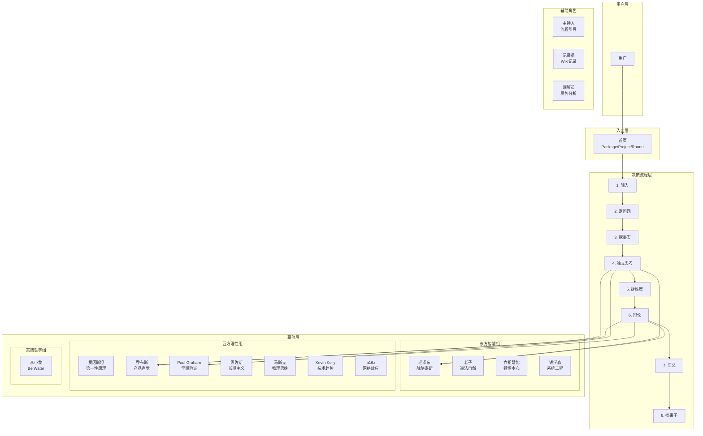
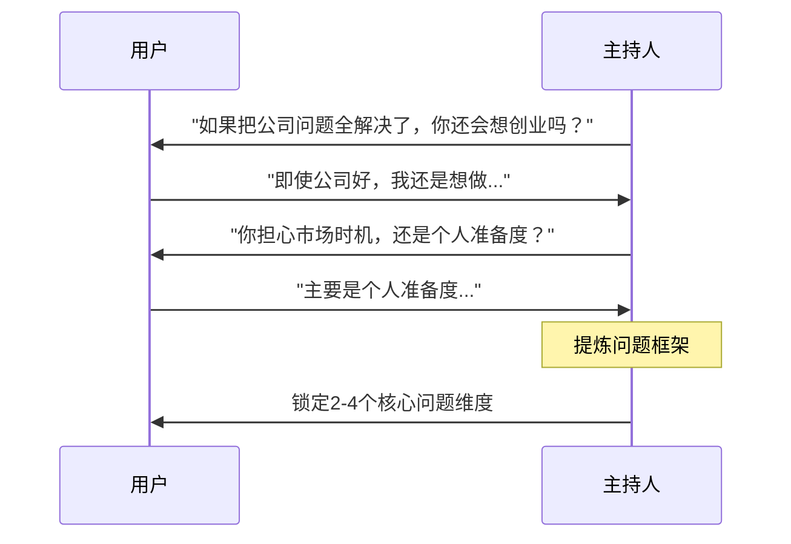
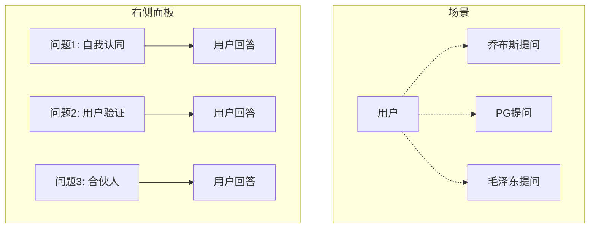
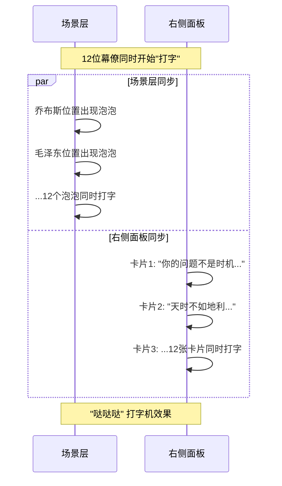
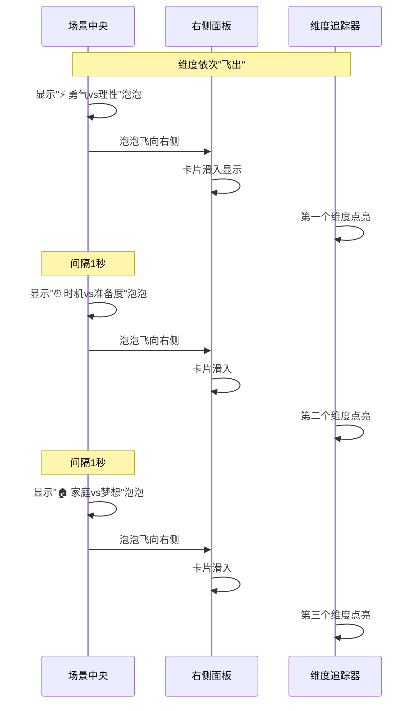
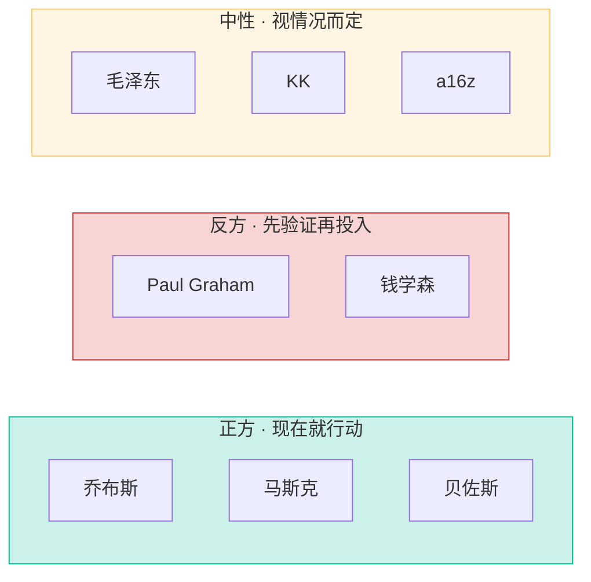

# 参谋 · Roundtable Advisor v8

> 十二位智者，照亮你的盲区  
> 一个结构化、可迭代的AI辅助决策系统

---

## 📋 目录

1. [项目概述](#项目概述)
2. [系统架构](#系统架构)
3. [三层数据结构](#三层数据结构)
4. [八步决策流程](#八步决策流程)
5. [交互说明](#交互说明)
6. [技术架构](#技术架构)
7. [文件结构](#文件结构)

---

## 项目概述

**参谋**是一个AI辅助决策系统，模拟"私董会"（Private Board）的形式，让12位不同领域的"幕僚"（AI角色）帮助用户深入思考重大决策。

### 核心理念

- **结构化思考**：将模糊的问题拆解为可分析、可验证的子问题
- **多角度审视**：12位幕僚从哲学、战略、产品、技术等不同维度提供观点
- **可迭代演进**：同一议题可以反复讨论，形成多轮迭代记录

### 适用场景

- 🚀 创业决策（产品方向、合伙人选择、全职/兼职等）
- 💼 职业发展（跳槽、转行、海外调动等）
- 🌟 人生重大选择（定居城市、婚姻、教育等）

---

## 系统架构

### 整体架构图



---

## 三层数据结构

### 架构示意图

```mermaid
graph TB
    subgraph Package层[决策包]
        P1[🚀 创业决策包]
        P2[💼 职业发展包]
        P3[🌟 人生决策包]
    end
    
    subgraph Project层[议题]
        P1 --> P1_1[产品方向验证]
        P1 --> P1_2[合伙人评估]
        P1 --> P1_3[全职创业决策]
        
        P2 --> P2_1[海外调动]
        P2 --> P2_2[转行AI]
    end
    
    subgraph Round层[迭代轮次]
        P1_1 --> R1_1_1[Round 1<br/>2024-01-15]
        P1_1 --> R1_1_2[Round 2<br/>2024-02-01]
        P1_1 --> R1_1_3[Round 3<br/>2024-02-20]
        
        P1_2 --> R1_2_1[Round 1<br/>2024-01-20]
        P1_2 --> R1_2_2[Round 2<br/>2024-02-10]
    end
    
    style P1 fill:#2d3436,stroke:#00b894
    style P2 fill:#2d3436,stroke:#0984e3
    style P3 fill:#2d3436,stroke:#e17055
```



### 数据关系说明

| 层级 | 说明 | 示例 |
|------|------|------|
| **Package** | 决策大类，按领域划分 | 创业决策、职业发展、人生决策 |
| **Project** | 具体议题，一个Package下可有多个 | 产品方向验证、合伙人评估 |
| **Round** | 迭代轮次，同一议题可反复讨论 | Round 1, Round 2, Round 3... |

### 为什么这样设计？

**现实场景**：
- 1月：你讨论"要不要全职创业" → 决定再观望
- 3月：情况变化，你想重新讨论同一议题 → 新建Round 2
- 每一轮的记录都保留，可以看到自己思考的变化

---

## 八步决策流程

### 流程总览


### 各步骤详解

#### Step 1: 输入 —— 说出你的困境
**目标**：让用户尽可能真实地描述处境

**交互**：
- 大文本输入框
- 字数统计
- 语音输入（可选）

**输出**：原始问题描述（保存在Wiki中）

---

#### Step 2: 定问题 —— 主持人澄清框架
**目标**：将模糊问题转化为可分析的结构

**交互**：


**输出**：问题框架（多选），如：
- [x] 个人准备程度是否足够？
- [x] 创业动机是真实渴望还是逃避？
- [ ] 家庭与梦想如何平衡？

---

#### Step 3: 挖事实 —— 幕僚轮询提问
**目标**：补充关键信息，暴露隐含假设

**交互设计**：


**特点**：
- 只有部分幕僚提问（通常3-4位）
- 问题以浮动卡片形式出现在对应幕僚旁边
- 回答后卡片消失，进入下一位

---

#### Step 4: 独立思考 —— 12幕僚并行发言
**目标**：获取多角度、独立的观点

**核心交互（炸裂效果）**：


**点击交互**：
- 点击卡片 → 展开完整发言（含HTML格式化）
- 再点同一卡片 → 折叠回摘要
- 点击幕僚头像 → 查看该幕僚档案

---

#### Step 5: 拆维度 —— 提取冲突维度
**目标**：从12个独立观点中找出核心分歧

**动画流程**：


---

#### Step 6: 辩论 —— 三方阵营交锋
**目标**：深入探讨核心分歧

**阵营划分**：


**视觉设计**：
- 正方：亮色边框+发光效果
- 反方：暗色边框
- 中性：半透明，不发光
- 非参与者：几乎不可见（opacity: 0.2）

---

#### Step 7: 汇总 —— 全场洞察精华
**目标**：提炼共识、分歧、隐藏变量

**内容结构**：
1. **核心共识**（12位幕僚一致认同的）
2. **最大分歧**（按阵营划分的不同观点）
3. **隐藏变量**（被提及但未深入的问题）
4. **结构洞见**（系统层面的规律）

---

#### Step 8: 摘果子 —— 收获与行动
**目标**：将讨论转化为可执行的洞察

**三部分内容**：
```mermaid
graph TB
    subgraph 幕僚观察
        O1[乔布斯: "你用理性包装感性"]
        O2[毛泽东: "缺乏关键变量考察"]
        O3[PG: "工程师思维陷阱"]
    end
    
    subgraph 我的收获
        Input[用户输入反思...]
    end
    
    subgraph 行动清单
        A1[ ] 找合伙人深度对话
        A2[ ] 联系3个潜在用户
        A3[ ] 最坏情况推演
    end
```

**完成功能**：
- 勾选行动项
- 返回首页（自动保存）

---

## 交互说明

### Toggle交互模式

| 元素 | 第一次点击 | 第二次点击 |
|------|-----------|-----------|
| 幕僚头像 | 展开档案面板 | 关闭档案，返回步骤 |
| 发言卡片 | 展开完整内容 | 折叠回摘要 |
| 记录员/调解员 | 展开Wiki/局势 | 关闭返回 |

### 布局切换

- **星环布局（⬤）**：12幕僚围绕用户，强调"众星拱月"
- **圆桌布局（⬡）**：45°俯视圆桌，强调"平等对话"

---

## 技术架构

### 技术栈

- **纯前端**：HTML5 + CSS3 + ES6+
- **无框架**：原生JavaScript，无React/Vue依赖
- **无构建工具**：直接打开HTML即可运行
- **响应式**：适配桌面端（主要场景）

### 文件组织

```
v8-app/
├── index.html          # 主入口
├── css/
│   ├── base.css        # 基础/动画
│   ├── home.css        # 首页样式
│   ├── layout.css      # 布局框架
│   ├── scenes.css      # 场景/角色
│   └── steps.css       # 8步流程
└── js/
    ├── data.js         # 幕僚数据/配置
    ├── home.js         # 首页逻辑
    ├── steps.js        # 步骤逻辑
    └── main.js         # 主入口/模式切换
```

### 核心数据结构

```javascript
// 12位幕僚
const MASTERS = [
  { id: 'jobs', av: '💼', name: '乔布斯', role: '产品哲学', ... },
  // ... 11 more
];

// 三层结构
const PACKAGES_DATA = {
  'startup': {
    name: '创业决策包',
    projects: {
      'p1': { name: '产品方向验证', rounds: [...] }
    }
  }
};

// 8步骤
const STEPS = [
  { id: 's1', label: '输入' },
  { id: 's2', label: '定问题' },
  // ... 6 more
];
```

---

## 使用说明

### 首次使用

1. 打开 `index.html`
2. 在首页选择或创建一个Project
3. 点击"进入圆桌"
4. 按步骤完成8步流程

### 继续之前的讨论

1. 首页找到对应的Project
2. 点击显示Round列表
3. 选择进行中的Round继续
4. 或点击"新建Round"开始新一轮

### 查看历史记录

- 点击左下角"记录员"查看Wiki
- 点击"调解员"查看当前局势分析

---

## 设计理念

### 为什么这样设计？

1. **结构化优于自由聊天**  
   无结构的AI对话容易发散，8步流程确保深度

2. **多轮迭代优于一次性**  
   重大决策需要时间沉淀，Round机制支持反复思考

3. **可视化优于纯文本**  
   场景化布局让抽象思考具象化

4. **历史记录优于遗忘**  
   所有讨论自动保存，可追溯思考演进

---

**版本**: v8  
**最后更新**: 2024年4月  
**作者**: Michael Huo
